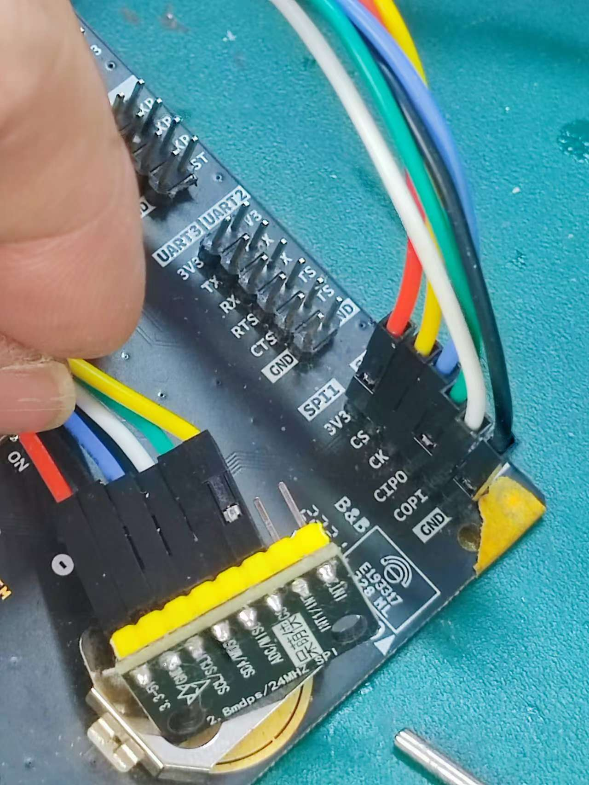
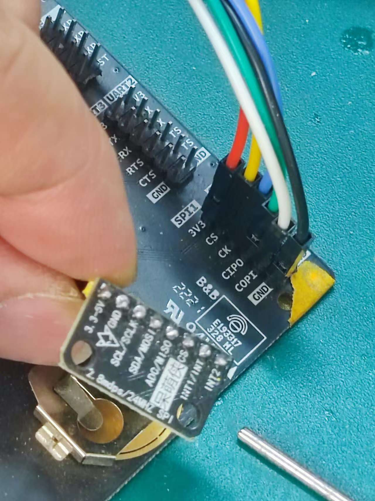
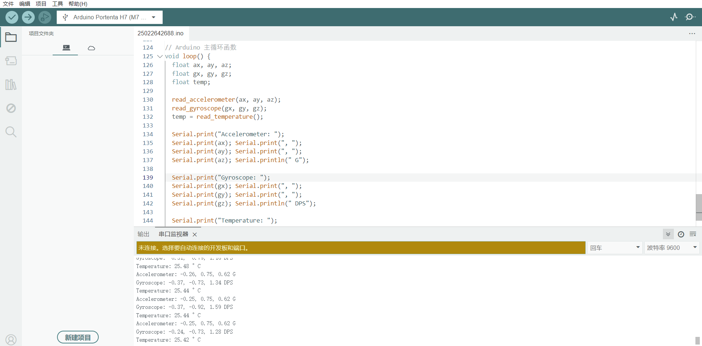

Hi,大家好
I'll create an Arduino sketch for the Portenta H7 to read data from the ICM42688 gyroscope via SPI1 and send it to the serial monitor at 9600 baud.

The code I've created translates the MicroPython driver to Arduino C++ for the Portenta H7, implementing SPI communication with the ICM42688 gyroscope sensor.
Key features of this implementation:

1,SPI Configuration: Uses the mbed SPI implementation with the correct pinout:
COPI (MOSI): PC3
CIPO (MISO): PC2
SCK: PI1
CS: PI0

2,Serial Communication: Sends data to the Arduino IDE's serial monitor at 9600 baud as requested.
Register Access Functions: Implements the necessary functions to read and write to the sensor registers:

writeRegister(): Writes a byte to a register
readRegister(): Reads a byte from a register
readMultipleRegisters(): Reads multiple bytes from consecutive registers

4,Sensor Initialization: Follows the same initialization sequence as the Python driver:

Resets the device
Verifies the WHO_AM_I register (should return 0x47)
Enables the accelerometer, gyroscope, and temperature sensor
Configures the data rates and ranges

5,Data Reading: 
Implements functions to read and convert sensor data:

Accelerometer data in g (gravity)
Gyroscope data in dps (degrees per second)
Temperature data in °C

6,Main Loop: Reads and displays all sensor data every second

To use this code, upload it to your Portenta H7 board and connect the ICM42688 sensor to the appropriate SPI pins. The serial monitor will display the sensor readings at 1-second intervals.

其运行效果和接线方案参见附件的两个图片

非常感谢：
1，https://forum.arduino.cc/t/minimal-example-of-spi-for-portenta-h7/695207 提供的SPI通信案例
